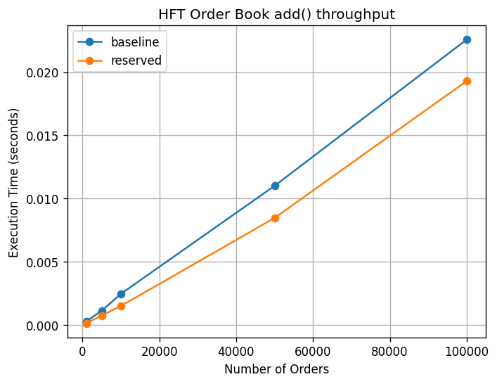

# HFT Phase 5: Order Book Performance

Order book built around the spec's mandated containers, with a benchmark
harness that measures `addOrder` throughput and a Python chart of
execution time vs. order count.

Phase 4 is preserved at the `phase4` git tag.

## Data Structures

```cpp
std::map<double, std::unordered_map<std::string, Order>> orderLevels;
std::unordered_map<std::string, Order>                   orderLookup;
```

`orderLevels` keeps prices sorted; `orderLookup` gives O(1) access by
string ID. `addOrder`, `modifyOrder`, `deleteOrder` keep both views in
sync and prune empty price levels on the way out.

## Build

Requires LLVM clang++, CMake, Ninja, and `uv` (for the Python scripts —
each declares its deps via PEP 723 inline metadata, so no separate venv).

```bash
just build      # release configure + build
just debug      # debug configure + build
just test       # debug build + Catch2 suite
just bench      # single bench run
just bench-all  # full N x seed matrix -> results/orderbook_add.csv
just plot       # render docs/orderbook_perf.png
just demo       # live-updating chart sweep, 1k -> 1M (for the video)
just stream     # paced order flow piped into a live depth chart
just asan       # asan/ubsan build + tests
just clean      # remove build/ and results/*.csv
```

`make` mirrors the same recipes.

## Benchmark

`bench/run_all.sh` sweeps N in {1k, 5k, 10k, 50k, 100k} with three seeds
per size, in two variants:

| Variant   | Change                                               |
|-----------|------------------------------------------------------|
| baseline  | `OrderBook book;` (the spec implementation)          |
| reserved  | `book.reserve(N)` so the lookup hash skips rehashes  |

Each run pre-generates inputs, then times only the `addOrder` loop.

## Results

Apple Silicon, Release build (`-O3 -march=native -flto`), single-threaded.
Per-op latency averaged across three seeds:

| Orders  | baseline ns/op | reserved ns/op | speedup |
|---------|---------------:|---------------:|--------:|
| 1,000   |          265   |          123   |  2.16x  |
| 5,000   |          220   |          144   |  1.53x  |
| 10,000  |          244   |          148   |  1.65x  |
| 50,000  |          220   |          169   |  1.30x  |
| 100,000 |          226   |          193   |  1.17x  |



Screen recording of the live demo and depth chart: [`docs/phase5_demo.mov`](docs/phase5_demo.mov).

Both curves scale linearly with N. The reserved variant wins by skipping
the ~17 rehashes a default-sized `unordered_map` performs on its way to
100k entries; the gap is largest at small N, where each saved rehash is
a larger fraction of total work.

## Notes on the Spec Optimizations

Phase 5 §3 lists three optimization techniques. Only one of them
materially helps this workload as written:

- **§3.1 Memory pool.** Reserving the lookup hash buckets is the cheap
  half of this; replacing the `std::map` node allocator would require
  storing `Order*` (or an index) in the level map and managing a free
  list. Skipped because the lookup-hash reserve already captures the
  dominant rehash cost.
- **§3.2 Loop unrolling.** The hot loop is one-`addOrder`-per-iteration;
  the per-op cost is dominated by the hash and tree insert, not the
  loop overhead. No measurable win here.
- **§3.3 Lock-free atomics.** Single-threaded workload, so no
  contention to remove.

## Layout

```
include/   Order.hpp, OrderBook.hpp (+ carryover Timer, ObjectPool)
src/       OrderBook.cpp
bench/     bench_main.cpp, run_all.sh
test/      test_orderbook.cpp (Catch2)
scripts/   plot_orderbook.py
docs/      orderbook_perf.png (generated)
results/   CSV output (gitignored)
```
