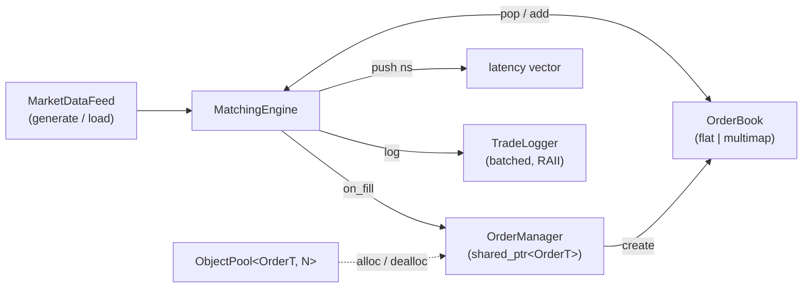

# Phase 4 Architecture

## Module Flow



## ASCII (for terminals / no-Mermaid renderers)

```
+-----------------+        +-----------------+        +-----------------+
| MarketDataFeed  | -----> |  OrderBook      | <----> | OrderManager    |
| (generate/load) |        | (flat | mmap)   |        | shared_ptr      |
+-----------------+        +-----------------+        +-----------------+
                                  |    ^                     ^
                                  v    |                     |
                          +-----------------+    +-----------------+
                          | MatchingEngine  |--> | TradeLogger     |
                          +-----------------+    +-----------------+
                                  |
                                  v
                          +-----------------+
                          | latency vector  |
                          +-----------------+
```

## Lifecycle of one `OrderT`

1. `OrderManager::create` allocates a slot from `ObjectPool` and wraps it in a
   `shared_ptr<OrderT>` whose deleter is `PoolDeleter<OrderT>`.
2. `OrderBook::add` stores a non-owning raw pointer to the same object.
3. `MatchingEngine` may call `OrderBook::pop_best_*` (which removes the raw
   pointer from the book) and `OrderManager::on_fill` (which removes the
   `shared_ptr` from `live_` once filled).
4. When the last `shared_ptr` is dropped, `PoolDeleter` returns the slot to
   the pool.

## Compile-time configuration

| Macro | Default | Effect |
|-------|---------|--------|
| `HFT_USE_RAW_PTR`    | `0` | Reserved for future raw-pointer storage variant. |
| `HFT_ALIGN_CACHE`    | `1` | `alignas(64)` on `MarketData`. |
| `HFT_USE_POOL`       | `1` | OMS uses `ObjectPool` (vs `new`/`delete`). |
| `HFT_BOOK_IMPL_FLAT` | `1` | Flat sorted-vector book (vs `std::multimap`). |
